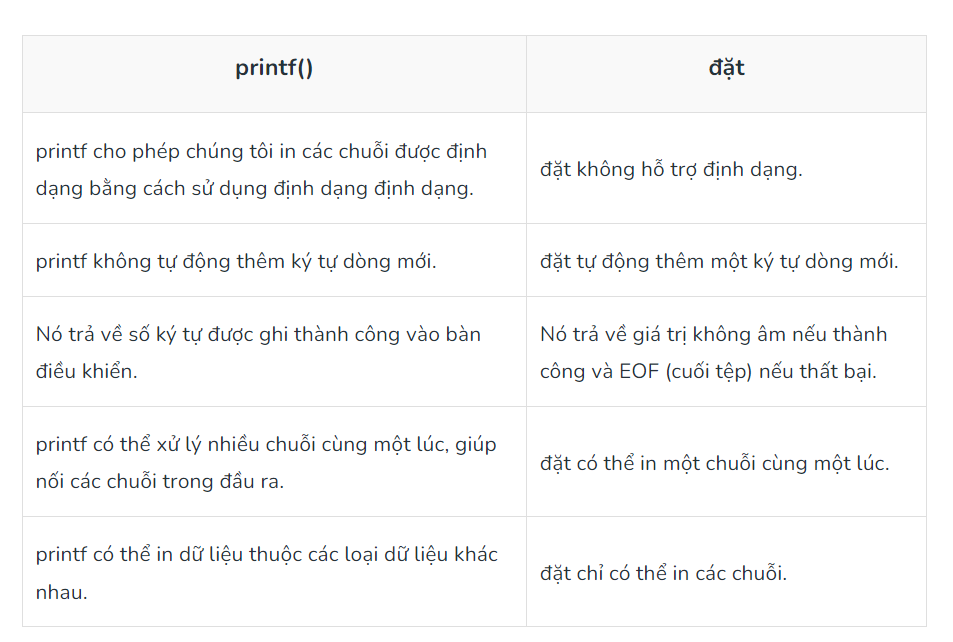

# BÁO CÁO TUẦN 1 (21/8/23 - 26/8/23)
## 1. Kiểu dữ liệu:
### Các kiểu dữ liệu cơ bản
| **Kiểu**         | **Kích thước** |
| ---------------- | -------------- |
| int (số nguyên)  | 16 bit         |
| char             | 8 bit          |
| float (số thực)  | 32 bit         |
| double (số thực) | 64 bit         |
| void             |                |
> float và double đều biểu diễn số thực. Nhưng float có độ chính xác đơn( 7 kí tự sau dấu phẩy), double có độ chính xác kép( 15 kí tự sau dấu phẩy).
- Có thể khai báo: `long float` = `double`
- xuất nhập kiểu định dạng: `char là %c`, `float là %f`, `double là %lf`
#### Note:
Ngoài các kiểu cơ bản còn có các dạn bổ sung chó các kiểu đó: 
-**signed**( kiểu có dấu)
- **unsigned**( kiểu không dấu)
- **short**( kiểu ngắn của kiểu cơ bản)
- **long**( kiểu dài của kiểu cơ bản)


#### Hằng số nguyên 
theo sau nó phải có 'l' hoặc 'L' nếu là dạng `long interger`
có 'u' hoặc 'U' nếu là dạng **unsigned**
> ví dụ 12UL 34U 23u
#### Hằng số thực có dấu chấm động 
theo sau nó phải có 'e' hoặc 'E' với số mũ đi theo

> **Hằng số nếu không phải là int thì nó là double**

#### Hằng kí tự
Được viết trong dấu `''`
ví dụ:
**'\0'** là NUL
**'\n'** là xuống dòng
**'\45'** là kí tự ASCII

### 2. Biến
- Biến cục bộ: nằm đầu phần thân của 1 hàm
- biến toàn cục: nằm ngoài all hàm
- Đối số hàm &rarr; int luy_thua(int n, char ket_qua)
#### const và volatile
- **const** để khai báo biến hằng( biến không thây đổi trong quá trình thực thi chương trình). Nếu kiểu hằng không được khai báo cụ thể thì mặc định nó là kiểu int (nếu khai báo 3.14 thì nó lưu 3)
> const int max=100;
- **volatile** dùng để khai báo biến( thường là biến toàn cục) thông báo cho compiler biết biến này có khả năng thay đổi bởi các tác nhân mà ngoài phạm vi dự đoán của compiler( bị thay đổi bởi ngắt hoặc ứng dụng đa luồn) và phải luôn cập nhật giá trị của biến này khi mang đi sử dụng( tránh việc compiler tối ưu hóa chương trình mà đọc ẩu :))

## 3. String
 - **String**( chuỗi) là 1 mảng các kí tự, nhưng khác mảng các kí tự là kết thức bằng kí tự '\0'
 > Khai báo chuỗi:  *char string_name[size];*
 - Có 4 cách khởi tạo chuỗi:
 > char str[] = "GeeksforGeeks";
 > char str[50] = "GeeksforGeeks";
 > char str[14] = { 'G','e','e','k','s','f','o','r','G','e','e','k','s','\0'};
 > char str[] = { 'G','e','e','k','s','f','o','r','G','e','e','k','s','\0'};
- Khi đọc chuỗi vào bộ nhớ mà dùng hàm scanf thì không có kí tự `&`
> scanf("%s",str);  **ĐÚNG**
> scanf("%s",&str); **SAI**

***Nếu trong chuỗi có khoảng trắng thì làm sao nhỉ???***
*Cách 1*
- Có thể đọc chuỗi theo chuẩn đầu vào (stdin) sử dụng
```c
// C program to illustrate
// fgets()
#include <stdio.h>
#define MAX 50
int main()
{
    char str[MAX];
 
    // MAX Size if 50 defined
    fgets(str, MAX, stdin);
 
    printf("String is: \n");
 
    // Displaying Strings using Puts
    puts(str);
 
    return 0;
}
```
*Cách 2*
```C
// C Program to take string separated by whitespace using
// scanset characters
#include <stdio.h>
 
// driver code
int main()
{
 
    char str[20];
 
    // using scanset in scanf
    scanf("%[^\n]s", str);
 
    // printing read string
    printf("%s", str);
 
    return 0;
}
```
### 4. Strings and Pointers in C
- Trong mảng, tên biến trỏ tới địa chỉ phần đầu tiên trong mảng. Tương tự, trong chuỗi ta tạo ra con trỏ để trỏ tới địa chỉ phần tử đầu tiên trong chuỗi.
**Đây là chương trình in từng kí tự trong chuỗi**
```C 
// C program to print string using Pointers
#include <stdio.h>
 
int main()
{
 
    char str[20] = "GeeksforGeeks";
 
    // Pointer variable which stores
    // the starting address of
    // the character array str
    char* ptr = str;
 
    // While loop will run till
    // the character value is not
    // equal to null character
    while (*ptr != '\0') {
        printf("%c", *ptr);
       
        // moving pointer to the next character.
        ptr++;
    }
 
    return 0;
}
```
#### printf() và put()
- Cả 2 đầu có thể dùng để in chuỗi, nhưng put() có cấu trúc gọn hơn và được ưu tiên sử dụng trong việc in chuỗi hơn
> **Cú pháp**
> puts("str"); in chuỗi và xuống dòng
> fputs(str, stdout); in chuỗi nà không xuống dòng
- Khác biệt:

#### Lưu trữ chuỗi
```C
char *str  =  "GfG"; 
```
Trong dòng trên, “GfG” được lưu ở vị trí chỉ đọc chung, nhưng con trỏ str được lưu trong bộ nhớ đọc-ghi. Bạn có thể thay đổi str để trỏ đến một thứ khác nhưng không thể thay đổi giá trị hiện tại của str. Vì vậy, loại chuỗi này chỉ nên được sử dụng khi chúng ta không muốn sửa đổi chuỗi ở giai đoạn sau trong chương trình.
## 5. Thư viện string.h
- Hàm strlen() : tính số kí tự của chuỗi trừ kí tự NULL '\0'
```C
# include<stdio.h>
# include<string.h>
int main(){
	char str[20]="hoangkien";
	int length=strlen(str);
	printf("do dai cua chuoi la %d",length);
}
```
- Hàm strcat(): ghép chuỗi
- Hàm strcpy(): copy n kí tự đầu tiên chuỗi này vào chuỗi khác
// C program to implement
// the above approach
```C
#include <stdio.h>
#include <string.h>
  
// Driver code
int main()
{
    // Define a temporary variable
    char example[100];
  
    // Copy the first string into
    // the variable
    strcpy(example, "Geeks");
  
    // Concatenate this string
    // to the end of the first one
    strcat(example, "ForGeeks");
  
    // Display the concatenated strings
    printf("%s\n", example);
  
    return 0;
}
```
- Hàm strcmp(): so sánh 2 chuỗi
> cú pháp: strcmp(first_str, second_str );
> Kết quả hàm này trả về 3 giá trị: dương ( first_str - second_str >0), âm ( first_str - second_str <0), 0 ( khi chúng trùng nhau)