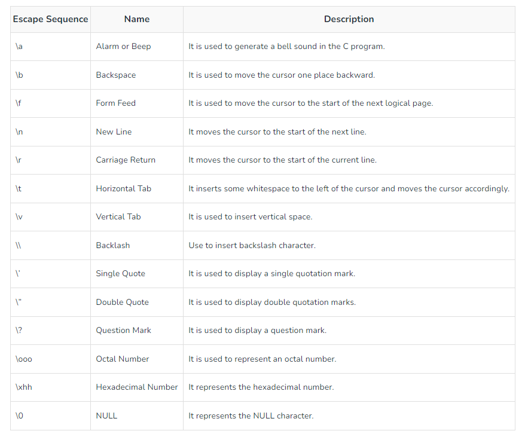
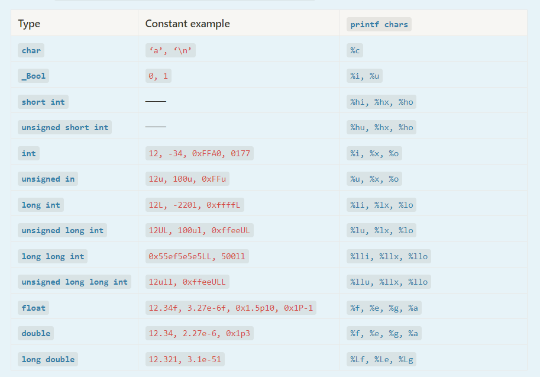
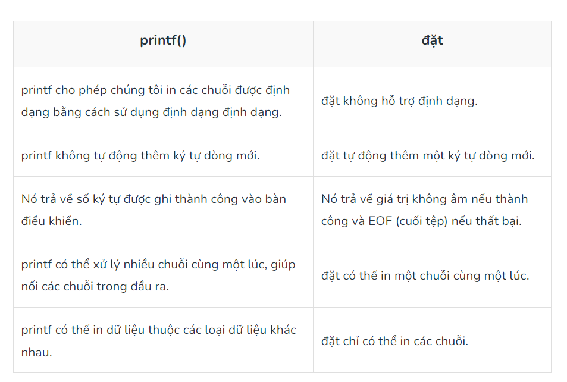

# BÁO CÁO TUẦN 1 (21/8/23 - 26/8/23)

## 1. Kiểu dữ liệu:

### Các kiểu dữ liệu cơ bản

| **Kiểu**         | **Kích thước** |  
| ---------------- | -------------- |
| int (số nguyên)  | 16 bit         |
| char             | 8 bit          |
| float (số thực)  | 32 bit         |
| double (số thực) | 64 bit         |

#### int

- Trong `int`, nếu 1 số nguyên, chữ thường hoặc chưx in bị đứng trước bởi `'0x'` thì nó nó được biểu diễn ở hệ thập lục phân.
> int rgbColor = 0xFFEF0D;

#### float và double

- float và double đều biểu diễn số thực. Nhưng float có độ chính xác đơn( 7 kí tự sau dấu phẩy), double có độ chính xác kép( 15 kí tự sau dấu phẩy). Double diễn tả số thực thì có kí tự 'f' hoặc 'F' ở cuối 
- Có thể khai báo: `long float` = `double`
- xuất nhập kiểu định dạng: `char là %c`, `float là %f`, `double là %lf`

#### _Bool

- Trả về giá trị 0 và 1, true/false, yes/no,

#### Các kiểu dữ liệu khác:

Ngoài các kiểu cơ bản còn có các dạn bổ sung cho các kiểu đó: 
- **signed**( kiểu có dấu)
- **unsigned**( kiểu không dấu)
- **short**( kiểu ngắn của kiểu cơ bản)

> - short int hay short có khả năng lưu trữ ít hơn int, dùng để tiết kiệm không gian hoặc dùng trong không gian lưu trữ giói hạn

- **long**( kiểu dài của kiểu cơ bản)

> - long int ngược lại với short

- **enum**

> enum dùng để thành lập kiểu dữ liệu mới
> 
> - *ví dụ:* 
> enum primaryColor {red, yellow, blue}; *lúc này ta có kiểu dữ liệ mới tên là primaryColor (giúng như int, float,...) với các giá trị của nó chỉ có ở đây là red(0), yellow(1), blue(2)*
> - Khai báo kiểu dữ kiệu mới như bình thường:
> primaryColor mycolor= red;

> Another ví dụ:
> - enum direction {up, down, lelf=10, right};
> các giá trị tương ứng với các phần tử là: up(0), down(1), left(10), right(11).

- **Escape Characters**



- **Format Specifiers**


#### Hằng số nguyên 

theo sau nó phải có 'l' hoặc 'L' nếu là dạng `long interger`
có 'u' hoặc 'U' nếu là dạng **unsigned**

> ví dụ 12UL 34U 23u

#### Hằng số thực có dấu chấm động 

- 1.7e4 ứng với với 1.7x10 luỹ thừa 4
- Khai báo long double theo sau phải cũng có 'l' hoặc 'L'. Ví dụ: 1.2345e+7L 

> **Hằng số nếu không phải là int thì nó là double**

#### Hằng kí tự

Được viết trong dấu `''`
ví dụ:
**'\0'** là NUL
**'\n'** là xuống dòng
**'\45'** là kí tự ASCII

### 2. Biến


- Constants là loại dữ liệu có giá trị không đổi trong quá trình thực hiện chương trình.
- Biến dùng để đặt tên cho memory location.
- Biến chứa  giá trị có thể thay đổi trong quá trình thực hiện chương trình.

> - Biến cục bộ: nằm đầu phần thân của 1 hàm
> - Biến toàn cục: nằm ngoài all hàm 
> - Đối số hàm &rarr; int luy_thua(int n, char ket_qua)

#### const và volatile

- **const** để khai báo biến hằng( biến không thây đổi trong quá trình thực thi chương trình). Nếu kiểu hằng không được khai báo cụ thể thì mặc định nó là kiểu int (nếu khai báo 3.14 thì nó lưu 3)
> const int max=100;

- **volatile** dùng để khai báo biến( thường là biến toàn cục) thông báo cho compiler biết biến này có khả năng thay đổi bởi các tác nhân mà ngoài phạm vi dự đoán của compiler( bị thay đổi bởi ngắt hoặc ứng dụng đa luồn) và phải luôn cập nhật giá trị của biến này khi mang đi sử dụng( tránh việc compiler tối ưu hóa chương trình mà đọc ẩu :))

## 3. String

 - **String**( chuỗi) là 1 mảng các kí tự, nhưng khác mảng các kí tự là kết thức bằng kí tự '\0'( null). Bất  kì kí tự gì khi được đặt trong dấu ngoặc kép thì đều được compiler hiểu là chuỗi.
 
 - Đừng nhầm lẫn null với NULL( vì NULL là ký hiệu đại diện cho một địa chỉ bộ nhớ không tham chiếu bất cứ thứ gì)
 
 > Khai báo chuỗi:  *char string_name[size];*

 - Có 4 cách khởi tạo chuỗi:

 > char str[] = "GeeksforGeeks";

 > - char str[50] = "GeeksforGeeks";

 > char str[14] = { 'G','e','e','k','s','f','o','r','G','e','e','k','s','\0'};

 > char str[] = { 'G','e','e','k','s','f','o','r','G','e','e','k','s','\0'};

 ```C
 /// Khai báo như vậy là error
 /// Vì string cũng là mảng và không ai khai báo mảng như này   
    char str[100]; 
    str="Hello";   

/// Phải làm như này
   
    char input[10];
    printf(”Please input your name: “);
    scanf(”%s”, input);  
```

- Khi đọc chuỗi vào bộ nhớ mà dùng hàm scanf thì không có kí tự `&`
> scanf("%s",str);  **ĐÚNG**

> scanf("%s",&str); **SAI**

***Nếu trong chuỗi có khoảng trắng thì làm sao nhỉ???***

*Cách 1*

- Có thể đọc chuỗi theo chuẩn đầu vào (stdin) sử dụng
```c
// C program to illustrate
// fgets()
#include <stdio.h>
#define MAX 50
int main()
{
    char str[MAX];
 
    // MAX Size if 50 defined
    fgets(str, MAX, stdin);
 
    printf("String is: \n");
 
    // Displaying Strings using Puts
    puts(str);
 
    return 0;
}
```

*Cách 2*

```C
// C Program to take string separated by whitespace using
// scanset characters
#include <stdio.h>
 
// driver code
int main()
{
 
    char str[20];
 
    // using scanset in scanf
    scanf("%[^\n]s", str);
 
    // printing read string
    printf("%s", str);
 
    return 0;
}
```
### 4. Strings and Pointers in C

- Trong mảng, tên biến trỏ tới địa chỉ phần đầu tiên trong mảng. Tương tự, trong chuỗi ta tạo ra con trỏ để trỏ tới địa chỉ phần tử đầu tiên trong chuỗi.

**Đây là chương trình in từng kí tự trong chuỗi**

```C 
// C program to print string using Pointers
#include <stdio.h>
 
int main()
{
 
    char str[20] = "GeeksforGeeks";
 
    // Pointer variable which stores
    // the starting address of
    // the character array str
    char* ptr = str;
 
    // While loop will run till
    // the character value is not
    // equal to null character
    while (*ptr != '\0') {
        printf("%c", *ptr);
       
        // moving pointer to the next character.
        ptr++;
    }
 
    return 0;
}
```
#### printf() và put()

- Cả 2 đầu có thể dùng để in chuỗi, nhưng put() có cấu trúc gọn hơn và được ưu tiên sử dụng trong việc in chuỗi hơn

> **Cú pháp**

> puts("str"); in chuỗi và xuống dòng

> fputs(str, stdout); in chuỗi nà không xuống dòng
- Khác biệt:


#### Lưu trữ chuỗi

```C
char *str  =  "GfG"; 
```
Trong dòng trên, “GfG” được lưu ở vị trí chỉ đọc chung, nhưng con trỏ str được lưu trong bộ nhớ đọc-ghi. Bạn có thể thay đổi str để trỏ đến một thứ khác nhưng không thể thay đổi giá trị hiện tại của str. Vì vậy, loại chuỗi này chỉ nên được sử dụng khi chúng ta không muốn sửa đổi chuỗi ở giai đoạn sau trong chương trình.

## 5. Thư viện string.h

- Hàm strlen() : tính số kí tự của chuỗi trừ kí tự null '\0'
```C
# include<stdio.h>
# include<string.h>
int main(){
	char str[20]="hoangkien";
	int length=strlen(str);
	printf("do dai cua chuoi la %d",length);
}
```
- Hàm strcat(): ghép chuỗi
- Hàm strcpy(): copy n kí tự đầu tiên chuỗi này vào chuỗi khác

// C program to implement
// the above approach
```C
#include <stdio.h>
#include <string.h>
  
// Driver code
int main()
{
    // Define a temporary variable
    char example[100];
  
    // Copy the first string into
    // the variable
    strcpy(example, "Geeks");
  
    // Concatenate this string
    // to the end of the first one
    strcat(example, "ForGeeks");
  
    // Display the concatenated strings
    printf("%s\n", example);
  
    return 0;
}
```
- Hàm strcmp(): so sánh 2 chuỗi
> cú pháp: strcmp(first_str, second_str );
> Kết quả hàm này trả về 3 giá trị: dương ( first_str - second_str >0), âm ( first_str - second_str <0), 0 ( khi chúng trùng nhau)

## 6. Mảng

- Khai báo mảng là khai báo tập hợp các giá trị có chung 1 kiểu dữ liệu
- Nếu chúng ta sử dụng 1 biểu thức hoặc 1 biến cho giá tị nằm ngoài phạm vi của mảng thì gọi là mảng ngoài giới hạn

>- int counter[5] = {0, 0, 0, 0, 0}; /*declares an array called counter to contain five integer values and initializes each of these elements to zero
>- float sample_data[500]={100.0, 330.3, 500.5}; /*initializes the first three value of sample_data to 100.0, 330.3, 500.5, and sets the remaining 497 elements to zero

- Khởi tạo mảng 2 chiều:

```C
int numbers[4][5]={
                   {10, 20, 34},
                   {11, 12, 43},
                   {15, 25, 35},
                   {45, 55, 65}
                  }; /*only initializes the first three elements of each row of the matrix to the indicated values, remaining values are set to 0
``` 

- **Khởi tạo chỉ định**: C99 cho phép ta chọn những phần tử được khởi tạo

```C
float sample_data[500]={[3]=500.5, [1]=330.3, [0]=100.0, [405]=12.0}; /*initializes the sample_data[3] to 500.5, sample_data[1] to 330.3, sample_data[0] to 100.0 and the sample_data[405] to 12.0
```

```C
int matrix[4][3]={[0][0]=1, [1][1]=3, [2][2]=5};
```
- Ngoài ra, còn có mảng nhiều hơn 2 chiều.

```c
int numbers[2][3][4] = {
      {             //First block of 3 rows
       {12, 14, 15, 16},
       {24, 25, 35, 46},
       {62, 74, 45, 36}
      },
      {             //Second block of 3 rows
       {67, 80, 5, 6},
       {21, 27, 38, 41},
       {2, 4, 5, 6}
   }
   ```
