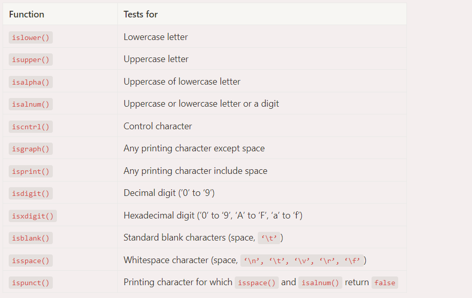
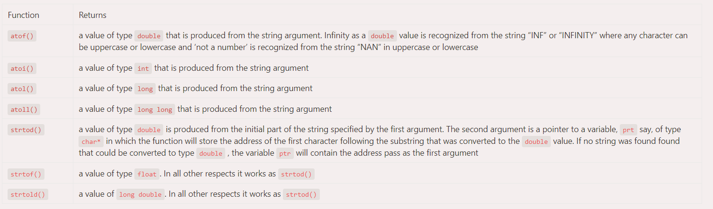
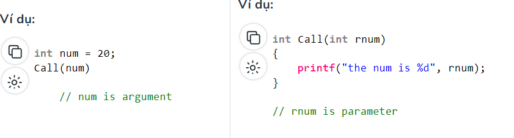
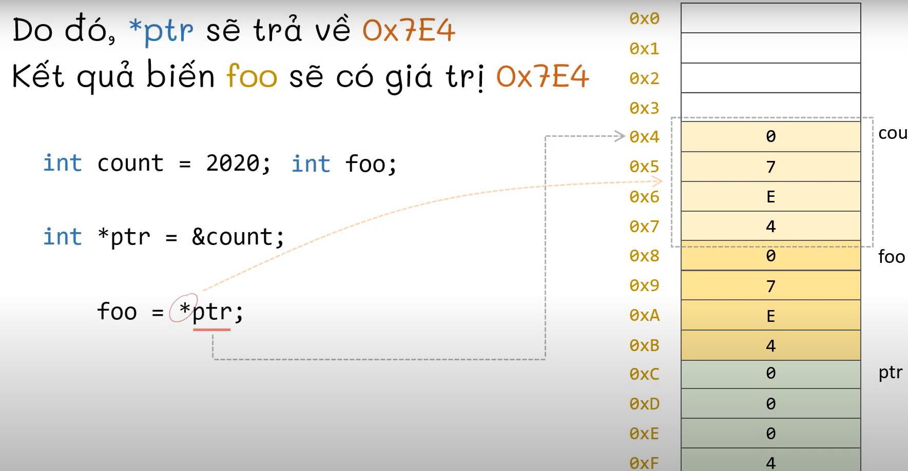

# BÁO CÁO TUẦN 2 (28/8/23 - 2/9/23)

## 1. String (continue)

#### #define and const

**define**

```C
#define TAXRATE 0.015
```

- **Define** dùng để đặt tên cho giá trị( không có khái niệm cục bộ). Ví dụ trên, mỗi khi TAXRATE được sử dụng thì sẽ được compiler hiểu là 0.015

- Khi sử dụng **Define** không có dấu bằng để gán, không được dùng dấy chấm phẩy

- **Define** thường được viết ở đầu chương trình để nhiều nguồn file dùng chung

- Nó cũng được dùng cho chuỗi hằng
```C
#define BEEP '\a'
#define TEE 'T'
#define ESC '\033'
#define OOPS "Now you have done it"
```
**constant**

- Dùng để khai báo biến kiểu hằng. Thường được sử dụng trong tính toán. Nói chùn nhìn khá giống với define.

- Khác Define là có thể dùng nó để khai bái chuỗi hằng kí tự làm standard message
```C
const char message[]=”The end of the world is night.”
```

#### # Phân tách chuỗi trong thư viện string.h

- Hàm strtok() được dùng để phân tách chuỗi và thường được dùng với vòng lặp. Hàm strtok() sẽ trả về toàn bộ chuỗi trước dấu phân cách đầu tiên
 ```C
#include <stdio.h>
#include <string.h>
// driver code
int main()
{
	char str[80]="Hello how are you-my name is-hnit";
	const char s[2]="-";
	char *token;

	/*get the first token*/
	token=strtok(str, s);

	/*walk through other tokens*/
	while(token!=NULL)
	{
		printf("%s\n", token);
		token=strtok(NULL, s);
	}
	return 0;
}
```
- Trong ví dụ trên, đấu phân cách là dấu "-"

#### # Một số hàm có sẵn trong ctype.h



#### #  Một số hàm có sẵn trong stdlib.h


## 2. Hàm trong C

- Khai báo hàm 

```C
 return_type name_of_the_function (parameter_1, parameter_2);
 ```
- Định nghĩa hàm
```C
return_type function_name (para1_type para1_name, para2_type para2_name)
{
    // body of the function
}
```
- Kiểu trả về của hàm cho biết loại giá trị nào được trả về sau khi tất cả hàm được thực thi. Khi không muốn trả về một giá trị, chúng ta có thể sử dụng kiểu dữ liệu void.

- Có 2 cách truyền đối sô cho hàm
>- Truyền bằng bằng giá trị(cách này đã biết) 

>- Gọi hàm bằng tham chiếu(sử dụng con trỏ): Cách này t có thể truyền giá trị bên ngoài trực tiếp vào hàm. Thường dùng để truyền chuỗi hoặc mảng vào hàm

ví dụ
```C
// C Program to implement
// Call by reference
#include <stdio.h>
  
// Call by reference
void swap(int* x, int* y)
{
    int temp = *x;
    *x = *y;
    *y = temp;
}
  
// Driver Code
int main()
{
    // Declaring Integer
    int x = 1, y = 5;
    printf("Before Swapping: x:%d , y:%d\n", x, y);
  
    // Calling the function
    swap(&x, &y);
    printf("After Swapping: x:%d , y:%d\n", x, y);
  
    return 0;
}
```
#### Có 4 loại hàm:

- Hàm có đối số và trả về giá trị:

```C
Function declaration : int function ( int );
Function call : function( x );
Function definition:
             int function( int x )
             {
               statements;
               return x;
             }   
```    
- Hàm có đối số nhưng không trả về giá trị:

```C
Function declaration : void function ( int );
Function call : function( x );
Function definition:
             void function( int x )
             {
               statements;
             }
```

- Hàm không có đối số và không trả về giá trị:

```C
Function declaration : void function();
Function call : function();
Function definition :
                      void function()
                      {
                        statements;
                      }
```
ví dụ
```C
// C code for function with no
// arguments and no return value
#include <stdio.h>
  
void value(void);
  
void main() { 
  value(); 
}
  
void value(void)
{
    float year = 1, period = 5, amount = 5000,
          inrate = 0.12;
    float sum;
    sum = amount;
    while (year <= period) {
        sum = sum * (1 + inrate);
        year = year + 1;
    }
    printf(" The total amount is :%f", sum);
}
```
- Hàm không có đối số nhưng trả về giá trị:

```C
Function declaration : int function();
Function call : function();
Function definition :
                 int function()
                 {
                     statements;
                      return x;
                  }
```
ví dụ
```C

// C code for function with no arguments
// but have return value
#include <math.h>
#include <stdio.h>
  
int sum();
  
int main()
{
    int num;
    num = sum();
    printf("Sum of two given values = %d", num);
    return 0;
}
  
int sum()
{
    int a = 50, b = 80, sum;
    sum = sqrt(a) + sqrt(b);
    return sum;
}
```
##### Sự khác nhau giữa hàm và đối số




## 3. Con trỏ trong C

- Con trỏ dùng để chứa địa chỉ bộ nhớ của biến, hàm, hoặc cả con trỏ khác.
> Cú pháp:
> datatype * ptr;

```C
int var = 10;
int *ptr = &var; hoặc int * ptr;
                      ptr = &var;
```

```C
// Giá trị trả về 
Value at ptr = 0x7fff1038675c (địa chỉ nhớ của biến var)
Value at var = 10 
Value at *ptr = 10 
```



**:))Cơ mà, giá trị trả về của `var` và `*ptr` giống nhau thì việc sử dụng con trỏ như này có tác dụng gì nhỉ????????:))** (dùng nó để truy xuất các giá trị trả về của hàm không trả về giá trị)
> Khi chúng ta tạo hàm void để hoán đổi 2 giá trị của 2 biến a và b thì khi ta gọi hàm trong chương trình chính giá trị của chúng ko thay đổi(chúng ta đã sử dụng truyền tham trị), thay vào đó ta sử dụng con trỏ để truyền vào hàm(truyền tham chiếu) thì sẽ cho ra kết quả ta cần

```C
#include <stdio.h>
#include <math.h>

void update(int *a,int *b) {
    int sum, sub;
    sum= *a + *b;
    sub= abs(*a - *b);
    *a = sum;
    *b = sub;
}

int main() {
    int a, b;
    int *pa = &a, *pb = &b;
    
    scanf("%d %d", &a, &b);
    update(pa, pb);
    printf("%d\n%d", a, b);

    return 0;
}
```

```C
#include <stdio.h>
 
char str[]="Tran Hoang Kien";
char *ptr= str;

int main()
{
	
	while(*ptr != '\0')
	{
		printf("%c",*ptr);
		ptr++;
	}
 
    return 0;
}
```

**Thêm 1 công dụng nữa của việc sử  dụng con trỏ**

```C
#include <stdio.h>
 
int sum(int a, int b, int *c)
{
	*c= a-b;
	return a+b;
}

int main()
{
	int d=2, e=3, hieu;
	printf("sum = %d\n",sum(d,e,&hieu));
	printf("hieu la %d",hieu);
    return 0;
}
```

**Có 1 đặc điểm nữa của con trỏ ở kq ví dụ sau**

```C

#include <stdio.h>
 


int main()
{
	int i=100;
	int *p=&i;
	*p=110;
	printf("%d\n",i);
	(*p)++;
	printf("%d\n",i);
	
 
    return 0;
}
```


Lưu ý: Khuyến cáo rằng con trỏ phải luôn được khởi tạo ở một giá trị nào đó trước khi bắt đầu sử dụng nó. Nếu không, nó có thể dẫn đến một số lỗi.

#### # Các loại con trỏ

1. <u>Con trỏ đến số nguyên</u>: như ví dụ trên

2. <u>Con trỏ đến mảng</u>

```C
  int arr[5] = { 1, 2, 3, 4, 5 };
  int *ptr = arr; // con trỏ trỏ tới kí tự đầu tiên của mảng

  int (*ptr)[10]; // con trỏ trỏ tới toàn bộ mảng
  ```

 Đọc thêm về con trỏ đến mảng 2 chiều: https://www.geeksforgeeks.org/pointer-array-array-pointer/ 

3. <u>Con trỏ cấu trúc</u>

4. <u>Con trỏ đến hàm</u>

> cú pháp:
> int (*ptr)(int, char);
code mẫu:
```C
#include <stdio.h>
// A normal function with an int parameter
// and void return type
void fun(int a)
{
    printf("Value of a is %d\n", a);
}
  
int main()
{
    // fun_ptr is a pointer to function fun() 
    void (*fun_ptr)(int) = &fun;
  
    /* The above line is equivalent of following two
       void (*fun_ptr)(int);
       fun_ptr = &fun; 
    */
  
    // Invoking fun() using fun_ptr
    (*fun_ptr)(10);
  
    return 0;
}
```
- Tên của hàm cũng có thể được sử dụng để lấy địa chỉ của hàm. Ví dụ: trong chương trình bên dưới, chúng tôi đã xóa toán tử địa chỉ '&' trong bài tập. Chúng tôi cũng đã thay đổi cách gọi hàm bằng cách bỏ *, chương trình vẫn hoạt động.

```C
#include <stdio.h>
// A normal function with an int parameter
// and void return type
void fun(int a)
{
    printf("Value of a is %d\n", a);
}
  
int main()
{ 
    void (*fun_ptr)(int) = fun;  // & removed
  
    fun_ptr(10);  // * removed
  
    return 0;
}
```
>Output:
Giá trị của a là 10
- Kết hợp sử dụng con trỏ với hàm: con trỏ hàm có thể được sử dụng thay cho trường hợp chuyển đổi. Ví dụ: trong chương trình bên dưới, người dùng được yêu cầu lựa chọn giữa 0 và 2 để thực hiện các tác vụ khác nhau.

```C
#include <stdio.h>
void add(int a, int b)
{
    printf("Addition is %d\n", a+b);
}
void subtract(int a, int b)
{
    printf("Subtraction is %d\n", a-b);
}
void multiply(int a, int b)
{
    printf("Multiplication is %d\n", a*b);
}
  
int main()
{
    // fun_ptr_arr is an array of function pointers
    void (*fun_ptr_arr[])(int, int) = {add, subtract, multiply};
    unsigned int ch, a = 15, b = 10;
  
    printf("Enter Choice: 0 for add, 1 for subtract and 2 "
            "for multiply\n");
    scanf("%d", &ch);
  
    if (ch > 2) return 0;
  
    (*fun_ptr_arr[ch])(a, b);
  
    return 0;
}
```
#### Trả về giá trị của mảng từ 1 hàm
```C
// C Program to return array from a function
#include <stdio.h>
 
// function
int* func()
{
    static int arr[6] = { 2,5,4,8,3,1};
 
    return arr;
}
 
// driver code
int main()
{
 
    int* ptr = func();
 
    printf("Array Elements: ");
    for (int i = 0; i < 5; i++) {
        printf("%d ", *ptr++);
    }
    return 0;
}
```
