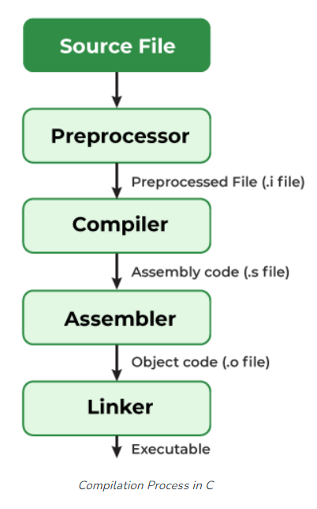
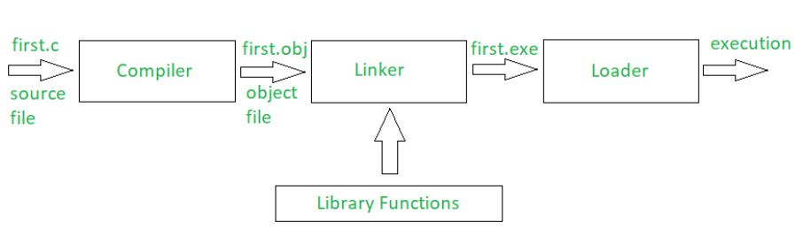

# BÁO CÁO TUẦN 3 (4/9/23 - 10/9/23)

## # 1. Câu lệnh:

#### # If statement

 Lệnh `if` có 5 loại:
 
 - if Statement (đã biết)
 - if-else Statement ( đã biết)
 - if-else-if Ladder ( đã biết)
 - switch Statement ( đã biết)
 - Conditional Operator
 
 **Conditional Operator**

 - Cú pháp: có thể ở 3 dạng:
 
 ```C
 variable = Expression1 ? Expression2 : Expression3;

 variable = (condition) ? Expression2 : Expression3;

 (condition) ? (variable = Expression2) : (variable = Expression3);
 ```

 Nó có thể được hình dung:

```C
 if(Expression1)
{
    variable = Expression2;
}
else
{
    variable = Expression3;
}
```
- Vì Toán tử có điều kiện '?:' cần ba toán hạng để hoạt động, do đó chúng còn được gọi là toán tử ba ngôi.

> Lưu ý: Toán tử ba ngôi có độ ưu tiên thấp thứ ba nên chúng ta cần sử dụng các biểu thức sao cho có thể tránh được lỗi do quản lý độ ưu tiên của toán tử không đúng.

#### # Goto statement

- Là câu lệnh nhảy vô điều kiện, có thể nhảy từ bất kì đâu đến bất kì chỗ nào trong chương trình

- Cú pháp:

```C
Syntax1      |   Syntax2
----------------------------
goto label;  |    label:  
.            |    .
.            |    .
.            |    .
label:       |    goto label;
```

**Nhược điểm**

- Câu lệnh goto không được khuyến khích vì nó làm logic chương trình khá phức tạp.
- Nó gây khó khăn cho việc xác định logic dòng chảy của vòng lặp
- Câu lệnh goto thường được tránh bằng việc sử dụng `break` hoặc `continue`

#### # Break và continue

1. Break:

- Câu lệnh `break` dùng để thoát ra khỏi vòng lặp
- Lưu ý: Lệnh break chỉ thoát ra khỏi một vòng lặp tại một thời điểm. Vì vậy, nếu trong vòng lặp lồng nhau, chúng ta sử dụng break in vòng lặp bên trong, điều khiển sẽ đến vòng lặp bên ngoài thay vì thoát ra khỏi tất cả các vòng lặp cùng một lúc. Chúng ta sẽ phải sử dụng nhiều câu lệnh break nếu muốn thoát ra khỏi tất cả các vòng lặp.
- Cách thoát ra khỏi vòng lặp vô hạn là thêm điều kiện `if`


2. Continue:


> - Câu lệnh break kết thúc vòng lặp và đưa điều khiển chương trình ra khỏi vòng lặp.
> - Câu lệnh continue chỉ kết thúc lần lặp hiện tại và tiếp tục với các lần lặp tiếp theo.


## 2. Các loại file trong C

#### #1. Biên dịch 1 chương trình C (Behind the sence):

- C là ngôn ngữ bậc trung cần được biên dịch thành những mã thực thi để máy thực hiện. Các giai đoạn của quá trình biên dịch như sau:


- Library trong C không phải là một phần của bất kỳ chương trình C nào mà là của phần mềm C. Vì vậy, trình biên dịch không biết hoạt động của bất kỳ hàm nào, cho dù đó là printf hay scanf. Định nghĩa của các hàm này được lưu trữ trong thư viện tương ứng mà trình biên dịch có thể liên kết.

- Cách mà chương trình C được thực thi:


- Các loại file được biên dịch để thực thi:
1. **Source file(.c):**  Các tệp này chứa các định nghĩa hàm và toàn bộ logic chương trình, những tệp này con người có thể đọc được và theo quy ước, tên của chúng kết thúc bằng .c
 
2. **Header file(.h):** Chúng được sử dụng để cho phép các tệp mã nguồn truy cập các hàm được xác định bên ngoài và theo quy ước, tên của chúng kết thúc bằng .h

3. **Object file(.o):** Các tệp này được tạo ra dưới dạng đầu ra của trình biên dịch. Chúng bao gồm các định nghĩa hàm ở dạng nhị phân, nhưng chúng không thể tự thực thi được.

4. **Binary executables file(.exe):** Các tệp này được tạo ra dưới dạng đầu ra của một chương trình được gọi là “ trình liên kết “. 

5. **Dynamic Library file(.so, .dylib, .dll):** đọc thêm https://www.geeksforgeeks.org/static-vs-dynamic-libraries/

#### #2 Cách viết Header file

- Các file có đuôi mở rộng .h là các header file, nó chứa các hàm được khai báo trong chương trình C. `stdio.h` là 1 ví dụ của header file. Và chúng ta có thể viết Header file của riêng mình.

> **Cách tạo**
> 1. Tạo 1 file có đuôi mở rộng `.h` và viết các hàm ta muốn vào đó. Ví dụ: week_3.h
> 2. Để gọi nó ra trong chương trình C: 

```C
#include"week_3.h"
```

> 3. Khi gọi nó ra phải để tên file trong dấu " "

Note:
> - Header file không được chứa các tệp dư thùa hoặc header file khác.
> - Đừng đặt định nghĩa của các hàm trong hàm tiêu đề mà nên đặt trong 1 file .c riêng biệt.
 
#### #3 Tiền xử lý trong C

- Tất cả các tiền xử lí được chỉ thị banwts đầu bằng dấu '#' và được đưa đến chương trình tiền xử lí để được thực thi.
 
 ## 3. Struct

 - Struct dùng để nhóm các loại mục khác nhau về cùng 1 loại duy nhất.
 - Các mục trong caaus trúc được gọi là member và có thể là bất ku=ì loại dữ liệu nào,
 - Ta phải khai báo Struct trước khi vào chương trình 
 - Cú pháp:
 - 
 ```C
    struct structure_name {
    data_type member_name1;
    data_type member_name1;
    ....
    ....
};
```
#### #1. Khởi tạo member trong Struct

// coi ké slide anh Minh ở đây: https://docs.google.com/presentation/d/1oWAIGLXuieagE_OMbtour0VVBhfeuQOs/edit?usp=drive_link&ouid=109479352250470865197&rtpof=true&sd=true

#### #2. Typedef

- Typedef là từ khóa được sử dụng để cung cấp tên mới cho các loại dữ liệu hiện có. Nó hoạt động như việc xác định bó danh cho câu lệnh.
- Cú pháp:

```C
typedef existing_name alias_name;
```
- Sau khi khai báo, chúng ta có thể sử dụng tên bí danh nếu như tên hiện có của nó đang nằm ngoài chương trình C.
```C

// C program to implement typedef
#include <stdio.h>
 
// defining an alias using typedef
typedef long long ll;
 
// Driver code
int main()
{
    // using typedef name to declare variable
    ll var = 20;
    printf("%ld", var);
 
    return 0;
}
```

**Ứng dụng của typedef**

1. Dùng để đặt tên có ý nghĩa cho dữ liệu đã có, để người dùng khác có thể hiểu được.
2. Nó có thể được sử dụng với các cấu trúc để tăng khả năng đọc mã và chúng ta không phải gõ struct nhiều lần.
```C
// C program to implement
// typedef with structures
#include <stdio.h>
#include <string.h>
 
// using typedef to define an alias for structure
typedef struct students {
    char name[50];
    char branch[50];
    int ID_no;
} stu;
 
// Driver code
int main()
{
    stu st;
    strcpy(st.name, "Kamlesh Joshi");
    strcpy(st.branch, "Computer Science And Engineering");
    st.ID_no = 108;
 
    printf("Name: %s\n", st.name);
    printf("Branch: %s\n", st.branch);
    printf("ID_no: %d\n", st.ID_no);
    return 0;
}
```
```C
// C Program to illustrate the use of typedef with
// structures
#include <stdio.h>
  
// defining structure
struct str1 {
    int a;
};
  
// defining new name for str1
typedef struct str1 str1;
  
// another way of using typedef with structures
typedef struct str2 {
    int x;
} str2;
  
int main()
{
    // creating structure variables using new names
    str1 var1 = { 20 };
    str2 var2 = { 314 };
  
    printf("var1.a = %d\n", var1.a);
    printf("var2.x = %d", var2.x);
  
    return 0;
}
```
3. Từ khóa typedef cũng có thể được sử dụng với con trỏ để khai báo nhiều con trỏ trong một câu lệnh. 
```C
typedef int* Int_ptr;
Int_ptr var, var1, var2;
```
> Cái này thì chỉ xem cho biết thôi chứ không nên dùng vì nó thay đổi cấu trúc khai báo

4. Nó có thể được sử dụng với mảng để khai báo bất kỳ số lượng biến nào.

**Typedef và #define**

...................để sau............

#### #3 Nested structure

- Nested structure trong C là cấu trúc được khai báo bên trong cấu trúc khác.
- Cú pháp:
```C
struct name_1
{
    member1;
   member2;
   .
   .
   membern;

   struct name_2
   {
       member_1;
       member_2;
       .
       .
      member_n;
   }, var1
} var2;
```
**Các cách để lồng Struct**

.............để sau .............


