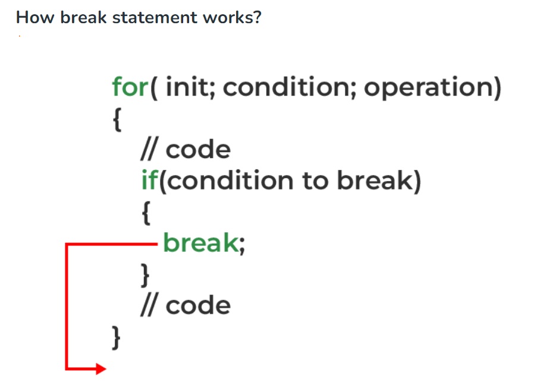

# BÁO CÁO TUẦN 3 (4/9/23 - 10/9/23)

## # 1. Câu lệnh:

#### # If statement

 Lệnh `if` có 5 loại:
 
 - if Statement (đã biết)
 - if-else Statement ( đã biết)
 - if-else-if Ladder ( đã biết)
 - switch Statement ( đã biết)
 - Conditional Operator
 
 **Conditional Operator**

 - Cú pháp: có thể ở 3 dạng:
 
 ```C
 variable = Expression1 ? Expression2 : Expression3;

 variable = (condition) ? Expression2 : Expression3;

 (condition) ? (variable = Expression2) : (variable = Expression3);
 ```

 Nó có thể được hình dung:

```C
 if(Expression1)
{
    variable = Expression2;
}
else
{
    variable = Expression3;
}
```
- Vì Toán tử có điều kiện '?:' cần ba toán hạng để hoạt động, do đó chúng còn được gọi là toán tử ba ngôi.

> Lưu ý: Toán tử ba ngôi có độ ưu tiên thấp thứ ba nên chúng ta cần sử dụng các biểu thức sao cho có thể tránh được lỗi do quản lý độ ưu tiên của toán tử không đúng.

#### # Goto statement

- Là câu lệnh nhảy vô điều kiện, có thể nhảy từ bất kì đâu đến bất kì chỗ nào trong chương trình

- Cú pháp:

```C
Syntax1      |   Syntax2
----------------------------
goto label;  |    label:  
.            |    .
.            |    .
.            |    .
label:       |    goto label;
```

**Nhược điểm**

- Câu lệnh goto không được khuyến khích vì nó làm logic chương trình khá phức tạp.
- Nó gây khó khăn cho việc xác định logic dòng chảy của vòng lặp
- Câu lệnh goto thường được tránh bằng việc sử dụng `break` hoặc `continue`

#### # Break và continue

1. Break:

- Câu lệnh `break` dùng để thoát ra khỏi vòng lặp
- Lưu ý: Lệnh break chỉ thoát ra khỏi một vòng lặp tại một thời điểm. Vì vậy, nếu trong vòng lặp lồng nhau, chúng ta sử dụng break in vòng lặp bên trong, điều khiển sẽ đến vòng lặp bên ngoài thay vì thoát ra khỏi tất cả các vòng lặp cùng một lúc. Chúng ta sẽ phải sử dụng nhiều câu lệnh break nếu muốn thoát ra khỏi tất cả các vòng lặp.
- Cách thoát ra khỏi vòng lặp vô hạn là thêm điều kiện `if`


2. Continue:


> - Câu lệnh break kết thúc vòng lặp và đưa điều khiển chương trình ra khỏi vòng lặp.
> - Câu lệnh continue chỉ kết thúc lần lặp hiện tại và tiếp tục với các lần lặp tiếp theo.