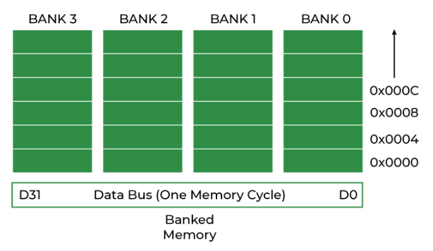
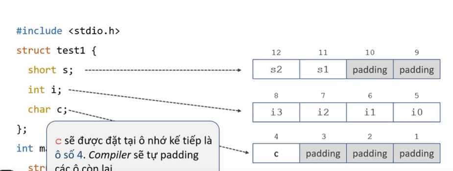
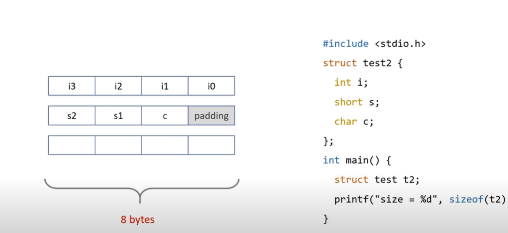
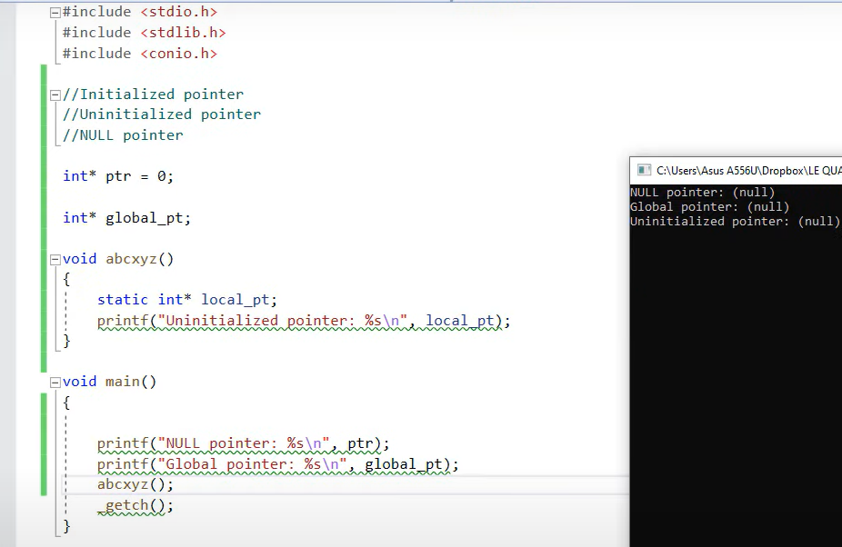
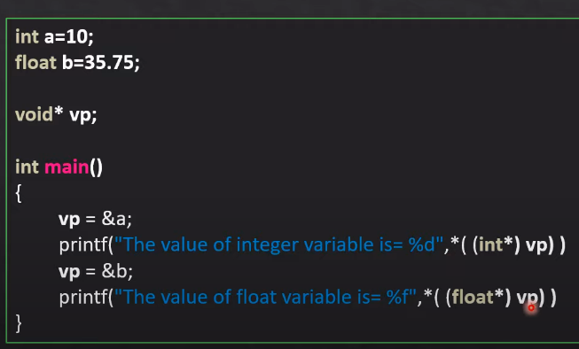
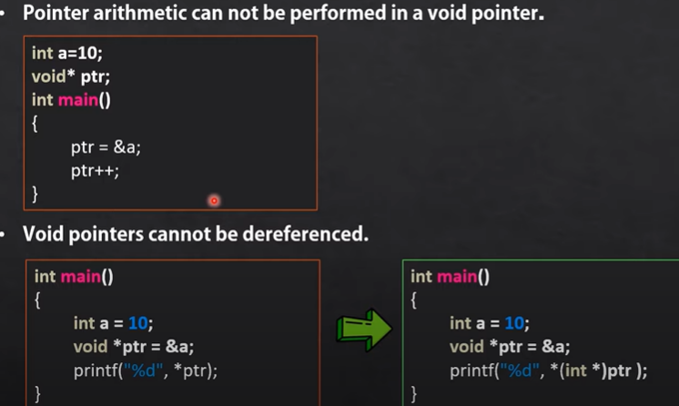
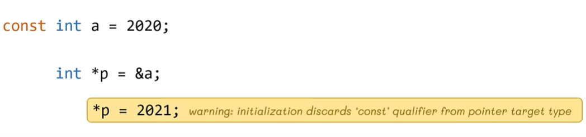
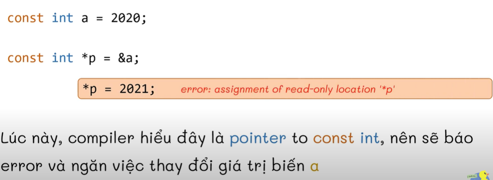
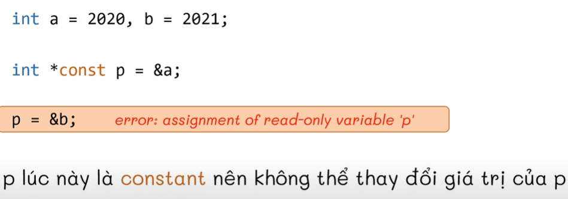
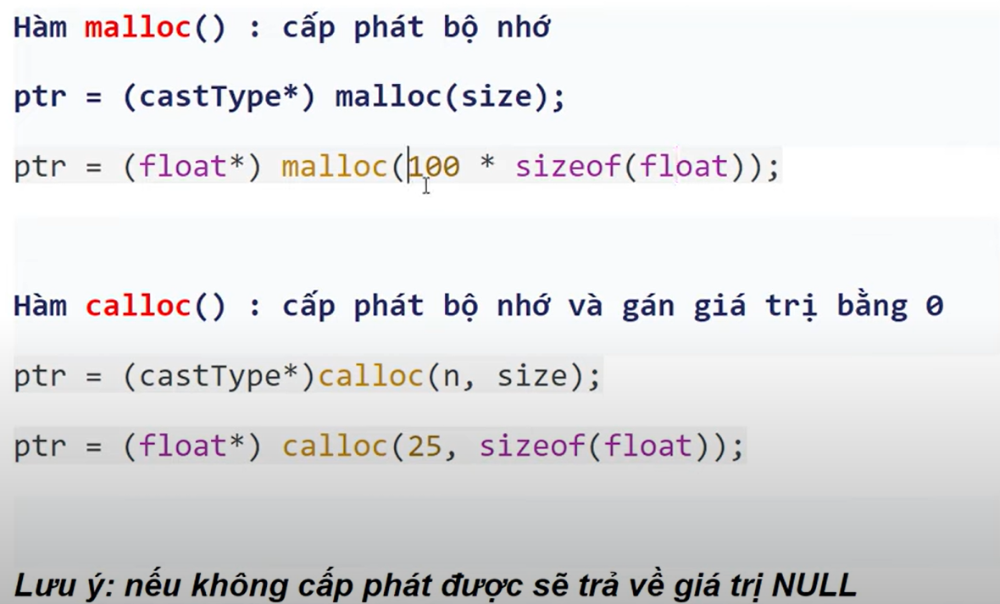

# BÁO CÁO TUẦN 4 (11/9/23 - 17/9/23)

## I. Struct(continue)

#### 1. Con trỏ trong Struct

- Con trỏ Struct có thể cho biết địa chỉ bộ nhớ struct và cấu trúc.
- Có 2 cách truy cập dữ liệu của biến con trỏ trong struct:
>- Với sự trợ giúp của toán tử dấu hoa thị (*) hoặc toán tử gián tiếp và toán tử dấu chấm (.).
>- Với sự trợ giúp của toán tử mũi tên ( -> )
- ví dụ:
```C
// C Program to demonstrate Structure pointer
#include <stdio.h>
#include <string.h>
 
struct Student {
    int roll_no;
    char name[30];
    char branch[40];
    int batch;
};
 
int main()
{
 
    struct Student s1;
    struct Student* ptr = &s1;
 
    s1.roll_no = 27;
    strcpy(s1.name, "Kamlesh Joshi");
    strcpy(s1.branch, "Computer Science And Engineering");
    s1.batch = 2019;
 
    printf("Roll Number: %d\n", (*ptr).roll_no);
    printf("Name: %s\n", (*ptr).name);
    printf("Branch: %s\n", (*ptr).branch);
    printf("Batch: %d", (*ptr).batch);
 
    return 0;
}
```
hoặc là
```C
// C Program to demonstrate Structure pointer
#include <stdio.h>
#include <string.h>
 
// Creating Structure Student
struct Student {
    int roll_no;
    char name[30];
    char branch[40];
    int batch;
};
 
// variable of structure with pointer defined
struct Student s, *ptr;
 
int main()
{
 
    ptr = &s;
    // Taking inputs
    printf("Enter the Roll Number of Student\n");
    scanf("%d", &ptr->roll_no);
    printf("Enter Name of Student\n");
    scanf("%s", &ptr->name);
    printf("Enter Branch of Student\n");
    scanf("%s", &ptr->branch);
    printf("Enter batch of Student\n");
    scanf("%d", &ptr->batch);
 
    // Displaying details of the student
    printf("\nStudent details are: \n");
 
    printf("Roll No: %d\n", ptr->roll_no);
    printf("Name: %s\n", ptr->name);
    printf("Branch: %s\n", ptr->branch);
    printf("Batch: %d\n", ptr->batch);
 
    return 0;
}
```

#### 2. Cấu trúc tự tham chiếu

- Cấu trúc tự tham chiếu là cấu trúc chứa tham chiếu đến nhũng cấu trúc cùng loại.
- cú pháp:
>struct structure_name {
    data_type member1;
    data_type member2;
    struct structure_name* str;
}

```C
// C program to illustrate the self referential structures
#include <stdio.h>
  
// structure template
typedef struct str {
    int mem1;
    int mem2;
    struct str* next;
}str;
  
// driver code
int main()
{
    str var1 = { 1, 2, NULL };
    str var2 = { 10, 20, NULL };
  
    // assigning the address of var2 to var1.next
    var1.next = &var2;
  
    // pointer to var1
    str *ptr1 = &var1;
  
    // accessing var2 members using var1
    printf("var2.mem1: %d\nvar2.mem2: %d", ptr1->next->mem1,
           ptr1->next->mem2);
  
    return 0;
}
```

#### 3. Sắp xếp dữ liệu Struct trong C

- Là cách mà dữ liệu được sắp xếp và truy cập trong C

- Khi máy 32 bit(4 bytes) lưu dữ liệu hay truy cập vào bộ nhớ thì nó nhìn bộ nhứ dưới dạng sau và mỗi chu kì truy xuất dữ liệu của nó là 4 bytes.


- Dữ liệu sẽ được sắp xếp như hình dưới để thuận tiện cho việc truy xuất dữ liệu. Các ô còn trống trên cùng 1 hàng sẽ được padding (để trống không làm gì cả) 

> Lí do sắp xếp dữ liệu như vậy thay vì ghép tụi nó liên tiếp với nhau là vì để tối ưu việc truy xuất dữ liệu. Nếu biến i được lưu nối tiếp với s thì ta sẽ mất 2 chu kì truy xuất dữ liệu cho biến i.

- Hiểu được cách sắp xếp này giúp ta tạo members trong struct tiết kiệm bộ nhớ hơn.
 **wow, infinity IQ :)**

##### Structure Packing

- Trong 1 số trường hợp, khi đọc 1 số tệp tiêu đề tệp ELF hoặc tiêu đề tệp BMP hoặc JPEG cần cẩn thận phải đọc từng byte. Trong trường hợp này, ta có thể tắt padding bằng cách sử dụng Structure Packing.

- Cú pháp:

>#pragma pack(1)

or

```C
struct name {
    ...
}__attribute__((packed));
```

- code mẫu:
```C

// C Program to demonstrate the structure packing
#include <stdio.h>
#pragma pack(1)
  
// structure A
typedef struct structa_tag {
    char c;
    short int s;
} structa_t;
  
// structure B
typedef struct structb_tag {
    short int s;
    char c;
    int i;
} structb_t;
  
// structure C
typedef struct structc_tag {
    char c;
    double d;
    int s;
} structc_t;
  
// structure D
typedef struct structd_tag {
    double d;
    int s;
    char c;
} structd_t;
  
int main()
{
    printf("sizeof(structa_t) = %lu\n", sizeof(structa_t));
    printf("sizeof(structb_t) = %lu\n", sizeof(structb_t));
    printf("sizeof(structc_t) = %lu\n", sizeof(structc_t));
    printf("sizeof(structd_t) = %lu\n", sizeof(structd_t));
  
    return 0;
}
```

## II. Pointer(continue)

#### 1. NULL Pointer

- Một biểu thức hằng số nguyên có giá trị 0 hoặc một biểu thức như vậy được chuyển thành kiểu void *, được gọi là hằng số con trỏ NULL.

> NULL trong pointer giống với NULL(con trỏ toàn cục không khơi tạo giá trị, hoặc con trỏ cục bộ không có giá trị nhưng khởi tạo với từ kháo static) và khác với NUL(kí tự cuối cùng của 1 chuỗi)



> Con trỏ NULL khi đươck khai báo sẽ được lưu vào ổ nhớ 0x00000... nhưng không được sử dụng ô nhớ đó. Có nghĩa là khi đã khai báo con trỏ NULL thì không thể gán nó lại với giá trị nào khác.

- Cú pháp khai báo:

```C
type pointer_name = NULL;
type pointer_name = 0;
```

- Công dụng của biến con trỏ NULL:
> 1. Để khởi tạo 1 biến xon trỏ khi con trỏ chưa được gán bất kì địa chỉ bộ nhớ hợp lệ nào

> 2. Để kiểm tra con trỏ null trước khi truy cập bất kỳ biến con trỏ nào. Bằng cách đó, chúng ta có thể thực hiện xử lý lỗi trong mã liên quan đến con trỏ, ví dụ: hủy đăng ký một biến con trỏ chỉ khi nó không phải là NULL.(chưa hiểu lắm)

> 3. Để chuyển con trỏ null tới đối số hàm khi chúng ta không muốn chuyển bất kỳ địa chỉ bộ nhớ hợp lệ nào.(chưa hiểu lắm)

> 4. Con trỏ NULL được sử dụng trong các cấu trúc dữ liệu như cây, danh sách liên kết, v.v. để biểu thị sự kết thúc.(chưa hiểu lắm).

**Khai báo và kiểm tra con trỏ có phải là NULL pointer ???**
```C

// C NULL pointer demonstration
#include <stdio.h>
  
int main()
{
    // declaring null pointer
    int* ptr = NULL;
  
    // derefencing only if the pointer have any value
    if (ptr == NULL) {
        printf("Pointer does not point to anything");
    }
    else {
        printf("Value pointed by pointer: %d", *ptr);
    }
    return 0;
}
```

#### 2. Void* pointer

- Void pointer là con trỏ mục địch chung có thể lưu trữ bất kì loại dữ liệu nào(char, int,...). Và khi muốn trỏ đến kiểu dữ liệu khác thì phải ép kiểu của kiểu dữ liệu đó.



> **Note**
> - Không thực hiện phép toán với con trỏ void
> - Không thể gán lại nó với giá trị khác(ko đc deference á, này giống với NULL pointer), nhưng ép kiểu rồi thì được.



#### 3. Darling pointer

- Con trỏ trỏ đến booj nhớ đã bị xóa được gọi là Darling Pointer. Có 3 cách khác nhau để con trỏ hoạt động như 1 con trỏ lơ lửng:

##### 1. Phân bổ lại bộ nhớ

```C
// Deallocating a memory pointed by ptr causes
// dangling pointer
#include <stdlib.h>
#include <stdio.h>
 
int main()
{
    int *ptr = (int *)malloc(sizeof(int));
 
    // After below free call, ptr becomes a
    // dangling pointer
    free(ptr);
     
    // No more dangling pointer
    ptr = NULL;
}
```


#### 4. Pointer to constant và const pointer

##### #1.Pointer to constant



- Khi khai báo `giá trị` biến hằng const a thì `giá trị` biến a vẫn có khả năng thông qua con trỏ *p. So, ta phải thêm const vào khi khai báo biến con trỏ:


- Đây là cú pháp khai báo Pointer to constant:


##### #2. Const pointer

- Cú pháp:


- Thay vì cố định **`giá trị`** trong suốt quá trình chạy chương trình C của `Pointer to constant` thì `Const pointer` cố định **`địa chỉ`** ô nhớ.



#### 5. Cách sử dụng con trỏ và cấp phát bộ nhớ động

- **Sử dụng thư viện `stdlib.h`**



- Trường hợp mà không được cấp phát bộ nhớ động là khi mà
máy không còn khu vực nào để cấp phát nữa, và lúc này ta phải giải phóng bộ nhớ bằng hàm `free()`.

```C

// Trying to dereferencing a null pointer
#include<stdio.h>
#include<stdlib.h>
int main()
{
	int n;
	printf("nhap n la ");
	scanf("%d",&n);
	/// Dung malloc de tao mang
	
	int *ptr= (int*)malloc(n*sizeof(int));
	for(int i=0; i<n; i++)
	{
		printf("a[%d]= ",i);
		scanf("%d",ptr+i);
	}
	
	/// Dung calloc de tao mang
	
	int *ptr= (int*)calloc(n, sizeof(int));
	for(int i=0; i<n; i++)
	{
		printf("a[%d]= ",i);
		scanf("%d",ptr+i);
	}
	
	///xuat mang
	
	for(int i=0; i<n; i++)
	{
		printf("a[%d]= %d\n",i,*(ptr+i));
	}
	
	free(ptr);// giai phóng bộ nhớ
	
	return 0;
}
```
