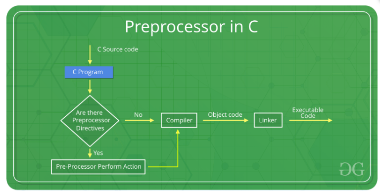
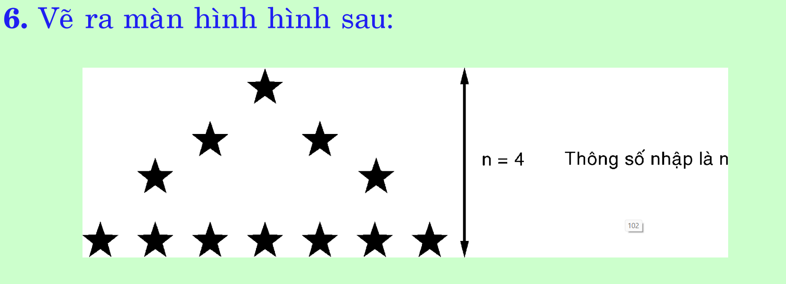
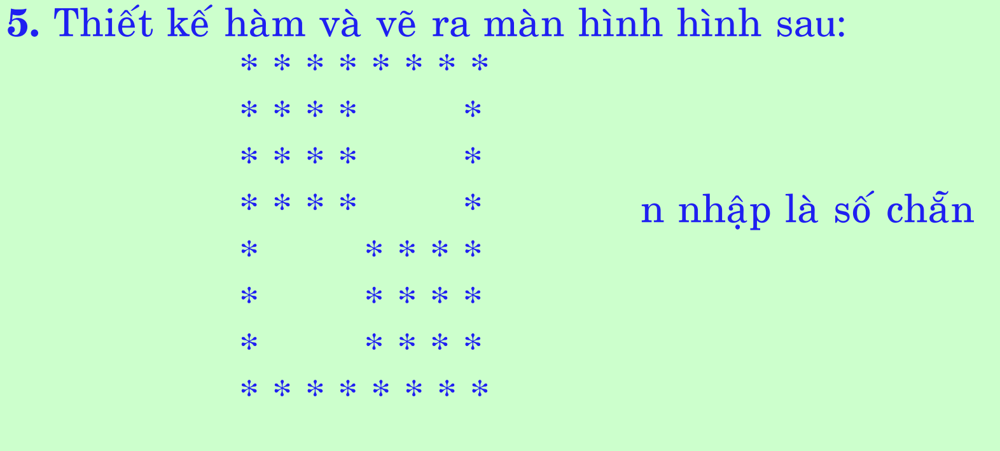

# BÁO CÁO TUẦN 5 (18/9/23 - 24/9/23)

## 1. Preprocessor



- Tiền xử lí (Preprocessor) là giai đoạn đoạn đầu tiền trong 4 giai đoạn để chạy 1 chương trình C được viết. Tiền xử lí cung cấp các chỉ thị tiền xử lí (đứng sau dấu `#`) và chúng được thực thi trong chương trình tiền xử lí. Chúng ta có thể đặt chỉ thị tiền xử lí ở bất kì đâu trong chương trình C

- Danh sách chỉ định tiền xử lí:

| Chỉ thị tiền xử lí | Định nghĩa                                                                                  |
| ------------------ | ------------------------------------------------------------------------------------------- |
| #define            | dùng để define a macro                                                                      |
| #undef             | dùng để undefine a macro                                                                    |
| #include           | dùng để đưa 1 tệp vào chương trình mã nguồn                                                 |
| #ifdef             | Được sử dụng để bao gồm một phần mã nếu một macro nhất định được xác định bởi #define       |
| #ifndef            | Được sử dụng để bao gồm một phần mã nếu một macro nhất định không được xác định bởi #define |
| #if                | Kiểm tra điều kiện đã chỉ định                                                              |
| #else              | Mã thay thế thực thi khi #if thất bại                                                       |
| #endif             | Dùng để đánh dấu sự kết thúc của #if, #ifdef và #ifndef                                     |

- Có 4 loại chỉ định tiền xử lí:
1. Macros
2. File Inclusion
3. Conditional Compilation
4. Other directives

#### 1. Marco

- Marco là 1 mảnh chương trình được đặt tên.
- Trong tiên xử lí thì các biến chưa được sinh ra vì vậy có dùng `#define` như một cách thay thế khai báo biến.
- `#define` được dùng để định nghĩa 1 Marco.
```C

// C Program to illustrate the macro
#include <stdio.h>
 
// macro definition
#define LIMIT 5
 
int main()
{
    for (int i = 0; i < LIMIT; i++) {
        printf("%d \n", i);
    }
 
    return 0;
}
```

- Trong ví dụ trên, mỗi khi compiler gặp **LIMIT** thì nó sẽ tự động thay thế bằng giá trị 5.

**Marco có đối số**

- Chúng ta có thể truyền đối số đến Marco. Nó làm việc như hàm
```C

// C Program to illustrate function like macros
#include <stdio.h>
 
// macro with parameter
#define AREA(l, b) (l * b)
 
int main()
{
    int l1 = 10, l2 = 5, area;
 
    area = AREA(l1, l2);
 
    printf("Area of rectangle is: %d", area);
 
    return 0;
}
```

#### 2. File Inclusion

- Header file thư viện có sẵn
```C
#include <file_name>
```

- Header file thư viện người dùng tự định nghĩa

```C
#include "filename"
```

#### 3. Biên dịch có điều kiện

- Biên dịch có điều kiện giúp trình biên dịch xác định các phần của chương trình và bỏ qua 1 số phần của chương trình dựa trên 1 số điều kiện trong quá trình biên dịch.

##### 1. ifdef

- Đây là chỉ thị đơn giản nhất. Khối này gọi là nhóm có điều kiện. 
- '#endif' luôn khớp với '#ifdef' (hoặc '#ifndef' hoặc '#if' gần nhất). Ta có thể lồng chúng vào nhau thành nhiều lớp với điều khiện chúng phải được lồng hoàn toàn vào nhau.
- Chúng chỉ được thực thi khi điều kiện đúng.
- Cú pháp:
```C
#ifdef MACRO
    controlled text
#endif /* macroname */
```

**Khối lệnh trong `#ifdef` được thực thi khi marconame được định nghĩa. Còn nếu không được định nghĩa thì khối lệnh sẽ bị bỏ qua**

- Từ đó, ta có chỉ thị `#ifndef` trái ngược với `#ifdef`

##### 2. ifndef

- Khối câu lệnh giữa #ifndef và #endif sẽ chỉ được thực thi nếu macro hoặc mã định danh có #ifndef không được xác định.

##### 3. #if, #else and #elif:

- Nếu điều kiện có lệnh #if đánh giá thành giá trị khác 0 thì nhóm dòng ngay sau lệnh #if sẽ được thực thi nếu không điều kiện có lệnh #elif đánh giá thành giá trị khác 0 thì nhóm dòng ngay sau lệnh #elif sẽ được thực thi, nếu không các dòng sau lệnh #else sẽ được thực thi. 
- Cú pháp:
```C
#if macro_condition
   statements
#elif macro_condition
   statements
#else
   statements
#endif
```

#### 4. Các chỉ thị khác:

- #undef Directive: để hủy định nghĩa mamà ta đã định nghĩa trước đó.
- #pragma Directive:
> #pragma startup: Những lệnh này giúp chúng ta chỉ định các hàm cần chạy trước khi khởi động chương trình (trước khi điều khiển chuyển sang main()).
> #pragma exit : Những lệnh này giúp chúng ta chỉ định các hàm cần chạy ngay trước khi thoát khỏi chương trình (ngay trước khi điều khiển quay về từ main()).


## 2. Bài tập C



```C
# include <stdio.h>

int main()
{
    int n;
	printf("nhap so n = ");
	scanf("%d",&n);
	for(int i=1; i<=n; i++)
	{
	    for(int j=n; j>=i; j--)
	    {
	        printf(" ");
	    }
	    printf("*");
	    if(i==1)
	    {
	        printf("\n");
	        
	    }else if(i==n)
	    {
	        for(int k=1; k<=(2*(i-1)-1); k++)
    	    {
    	        printf("*");
    	    }
    
    	    printf("*\n");
	    }
	    else
	    {
    	    for(int k=1; k<=(2*(i-1)-1); k++)
    	    {
    	        printf(" ");
    	    }
    
    	    printf("*\n");
	    }
	}
	
	return 0;
}
```


```C
# include <stdio.h>

int main()
{
    int n;
    printf("nhap so n ");
    scanf("%d",&n);
    for(int i=1; i<=n; i++)
    {
        for(int j=1; j<n; j++)
        {
            if(i==1 || j==1 || i==n)
            {
                printf("*");
            }
            else if((j>(n/2)) && (i<=(n/2)))
            {
                printf(" ");
            }else if((j<=(n/2)) && (i>(n/2)))
            {
                printf(" ");
            }else
            {
                printf("*");
            }
        }
        printf("*\n");
    }
	
	return 0;
}
```
