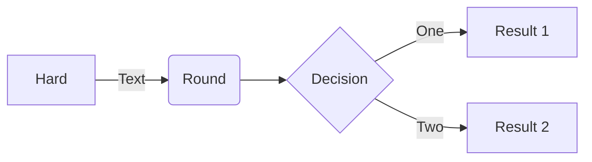

# Markdown

## Markdown là gì?

Markdown là một ngôn ngữ đánh dấu với cú pháp văn bản thô, được thiết kế để có thể dễ dàng chuyển thành nhiều định dạng khác.

## Plugin

- Markdown All in One
- Markdown Preview Enhance

## Formatting

**In đậm**, __In đậm__

*In nghiên*, _In nghiên_

***In đậm và in nghiên***, ___In đậm và in nghiên___

> This is quote

This is `inportant`

~~This is Strikethrough~~

<u>This is underline</u>

## Special characteristic

Up arrow: &uarr;

Down arrow: &darr;

Left arrow: &larr;

Right arrow: &rarr;

Double headed arrow: &harr;

## Link

[PIFLab](https://www.forum.payitforward.edu.vn/cgi-sys/suspendedpage.cgi)

## Table

- F1 - Search - markdown preview enhanced: insert table
- F1 - Format Document
- F1 - Increment Selection 
- F1 - Increment by 1
- Sử dụng dấu : để canh lề

| #   | Title 1     | Title 2     | Number |
| --- | :---------- | ----------- | -----: |
| 0   | Content 1-2 | Content 2-2 |      2 |
| 1   | Content 1-1 | Content 2-1 |      2 |
| 2   | Content 1-2 | Content 2-2 |      2 |
| 3   | Content 1-1 | Content 2-1 |      2 |


## Code style

```C
printf("hello world);
```

```js
console.log(1024);
```

## Image

- Copy hình ảnh và F1 - paste


## Graph

- Mermaid: https://github.com/mermaid-js/mermaid



- PlantUML: https://plantuml.com/

## Math

$y = x^2$
$I_R = U_R * R$

## Inport file


@import "Week_1.md"

